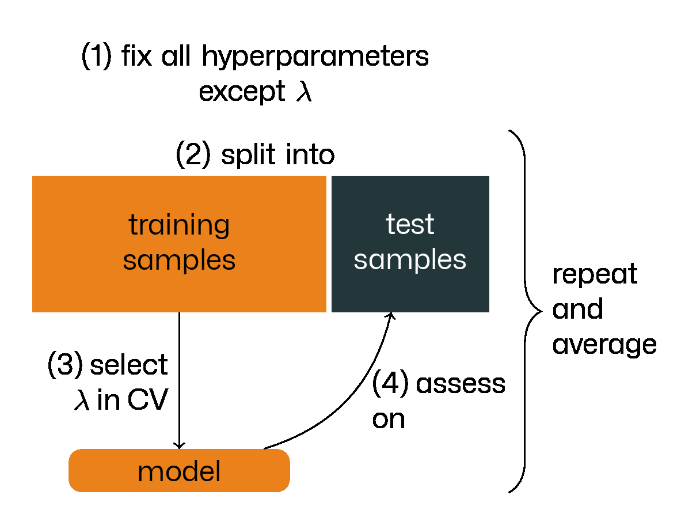
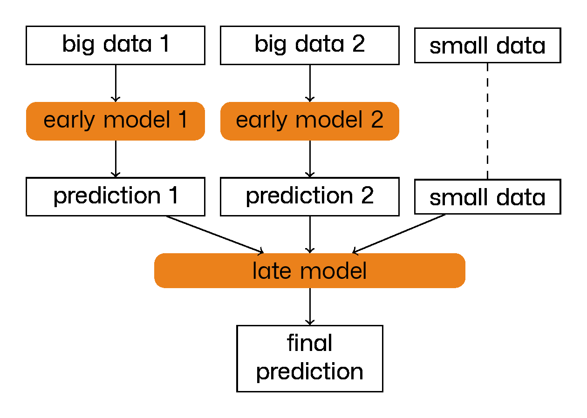

# patroklos

  <!-- badges: start -->

  [](https://github.com/lgessl/patroklos/actions/workflows/R-CMD-check.yaml)

  <!-- badges: end -->

## A pipeline to learn omics-based survival models for cancer patients

### What's the scenario this R package is made for?

Imagine you are given a data set holding information on cancer patients. This data includes a high-dimensional 
measurement like bulk RNA-seq data ("expression data") and some other features ("pheno data"). Among the pheno data
is survival information in the form of time to event and right censoring. You want to build a binary classifier 
that takes a subset of your features (excluding the two survival features) as input to predict for a given sample 
if it faces the event (like progression or death) before or after a certain time.

Finding such a classifier involves a lot of trial and error: you will try out a whole bunch of models. Every model 
family again involves some hyperparameters you need to tune. The high-dimensional part of your data requires you 
to apply regularization to your models, in other words: tuning a regularization parameter. After you've trained 
the models, you need to assess them and finally come up with the "best" one, where you first need to decide what 
you mean by "best".

Even after you've picked a winner, this is just the winner on a specific data set. Somebody (maybe even yourself) 
may come up with another data set and you need to do an analogous analysis on the new data set.

patroklos will do all the repetitive, administrative work and lets you focus on the mathematical 
and biological part of your work.

All in all, patroklos is not the star of the show, but it plays a key role in it—just like Πάτροκλος in the
Iliad: being Achilles' best friend, his death brings Achilles back to the battlefield helping the Greeks 
score decisive victories.

### How does this R package make your life easier?

patroklos has three major goals: making integrating 

- new data,
- new models and 
- new kinds of assessments 

into your workflow as easy and effortless as possible without forcing you too much to use a certain paradigm.

#### Data

We give you the tools to preprocess new data and bring it into the format patroklos works with. 
You specify and store everything in the R6 class `Data`.

#### Models

You specify models in another R6 class, `Model`; "specifying" means fixing all hyperparameters except for the 
regularization parameter $\lambda$. Why? To tune $\lambda$ we split the data into a train and test cohort 
and determine its optimal choice in a cross validation on the train cohort. The function optimizing $\lambda$ and 
all the other model parameters is an attribute of the `Model` object and you can easily provide your own ones.

#### Assessment

On the test cohort (which we haven't touched so far) we can now assess the trained models. Keep in mind that most 
models used as binary classifiers don't output the final classification, but only continuous score that 
we need to threshold (this threshold is yet another hyperparameter of the model). To find the model best 
fullfilling its job and threshold it, we proceed as follows:

1. In a pre-selection step, we map every trained model to a single real number: a score indicating its goodness 
   on the test cohort (like the ROC-AUC). Of course, you can define your metric here. This allows us to reduce 
   the models of interest to an arbitrary small number if not one. The R6 class `AssScalar` does this.
2. For the remaining models, we plot one metric against another metric (e.g. rate of positive predictions 
   versus precision). Keep in mind: we essentially get as many points in the two-dimensional space as the 
   model has different output values here as we can use every output value as a threshold. This plot or 
   these plots will guide our decision for a threshold and therefore for a final binary classifier. The 
   R6 class `Ass2d` does this.

#### In a nut shell



### More tweaks powered by patroklos

#### Repeated splits into training and test cohort

Splitting your data into a training and test cohort is very close to the real-world scenario, in which the entity 
generating the data withholds the test cohort in the first place and you are only given the training cohort. 
Sometimes this split may be lucky for you, sometimes it may be really tough, but this randomness is not in your 
heads. What is in your hands though is to submit the model with the best expected (or average) performance in 
such a scenario. patroklos lets you easily repeat the training part for 
multiple splits into training and test data and averages in a reasonable manner in the assessment step.

#### Storing and reading in models

Training and asssessing so many models takes a lot of time. So as your project evolves over time, you don't 
want to fit your models again and again. To this end, patroklos heavily resorts 
to storing the models and reading them in on demand. Typically you would also "store" the `Model`, `AssScalar` and 
`Ass2d` objects, either as an .rds file or, more typically, their initialization in an R script. Adding a new model 
or assessment is then equivalent to adding some lines of code to hese R scripts. Typically, you would store your 
models below `models/<data-set name>`, patroklos will then store the assessments in the analogous 
file tree below `results/<data-set name>`. 

#### Early integration

For a set of diverse features (keep in mind: high-dimensional data and pheno data), it is tempting and simple 
to do early integration, i.e. providing them to a well known model with a well implemented fitting algorithm. 
While patroklos assumes you always give the model the high-dimensional omics data, 
you have the freeedom to add features from pheno data, continuous and categorical ones alike. When I started 
designing this package, I had the [`zeroSum`](https://github.com/rehbergT/zeroSum) package delivering the key 
models that deal with the high-dimensional data in my mind. The `zeroSum` package provides all the functionality 
of the [`glmnet`](https://github.com/cran/glmnet) with each (generalized linear) model optionally endowed with 
the zero-sum constraint that causes the model to become scale-invariant. patroklos provides 
a wrapper around `zeroSum::zeroSum` named `zeroSumLI` to make `zeroSum` ready for early integration.

Schematically this renders as follows:


#### Late integration

Early integration seems easy at first glance, but sometimes the fitting algorithm might not be able to handle 
the data you provide: features on vastly different scales. In such a case, you may want to prefer late 
integration, i.e. first training an "early" model on the high-dimensional data and then using its (scalar) output 
together with some more pheno features as the input of another, "late" model. 

I'm currently working to include late integration in patroklos and provide fitting 
algorithms to do this. 

Nesting a regularized model whose regularization is tuned in a cross validation into a another model means 
training the resulting model involves a cross validation. We should continue the cross validation of the 
early model into the late model. I made `zeroSum` report enough details on the (many, many) models fit in 
a cross validation in a fork called [`zeroSumLI`](https://github.com/lgessl/zeroSumLI). 

Nesting has no limits as the below picture shows.



### Installation

Make sure you have the `devtools` package installed, start an R session and then type:
```R
devtools::install_github("lgessl/patroklos")
```

### Quick start

There are four R6 classes a user of patroklos needs to know about: `Data`, `Model`, 
`AssScalar` and `Ass2d`. To understand how they work together over the course of the pipeline and 
how to use patroklos for your project, you should read their documentation in the same 
order.